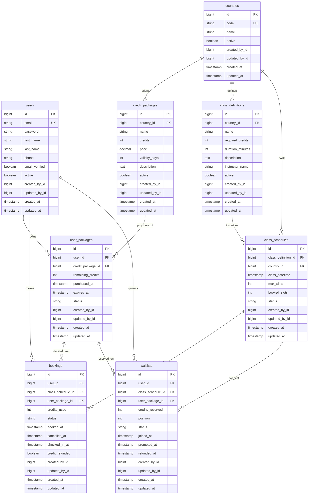

# Booking System (Java / Spring Boot)

REST API for a mobile booking app: user registration with email verification, JWT auth, country-scoped credit packages, class schedules, bookings with overlap rules, waitlists (FIFO), Quartz jobs, and Redis-backed caching plus distributed locks for concurrent booking.

## Tech stack

| Area | Choice |
|------|--------|
| Runtime | Java 21, Spring Boot 3.5 |
| Database | PostgreSQL (JPA / Hibernate) |
| Cache / locks | Redis (Spring Cache + booking locks) |
| Auth | Spring Security + JWT (Bearer) for protected APIs |
| Jobs | Quartz |
| API docs | Springdoc OpenAPI (Swagger UI) |

## CI (GitHub Actions)

On push/PR to `main`, `master`, or `develop`, and on version tags `v*`, [`.github/workflows/ci.yml`](.github/workflows/ci.yml) runs **Maven build + tests** against **PostgreSQL 16** and **Redis 7** services, uploads Surefire reports, and (on non-PR pushes) **builds and pushes** a Docker image to **GHCR** (`ghcr.io/<owner>/<repo>`). Tag pushes `v*` also create a **GitHub Release** with the built JAR.

Tests use profile **`ci`** ([`application-ci.properties`](src/main/resources/application-ci.properties)): Quartz jobs are off and CRUD response cache is disabled via `CRUD_CACHE_ENABLED=false` for stable `contextLoads`.

## Prerequisites

- **JDK 21** and **Maven 3.9+**
- **PostgreSQL** (empty database; Hibernate `ddl-auto=update` creates tables on startup)
- **Redis** (required for auth token storage, CRUD cache, and booking concurrency locks)

## Configuration

1. Copy the environment template and fill in values:

   ```bash
   cp .env.example .env
   ```

2. Set at least:

   | Variable | Purpose |
   |----------|---------|
   | `SPRING_DATABASE_URL` | JDBC URL, e.g. `jdbc:postgresql://localhost:5432/booking_system` |
   | `SPRING_DATABASE_USERNAME` | DB user |
   | `SPRING_DATABASE_PASSWORD` | DB password |
   | `JWT_SECRET` | Long random string for signing JWTs (do not use the default in production) |
   | `REDIS_HOST` | Default `localhost` if Redis runs on the host |
   | `REDIS_PORT` | Default `6379` |
   | `REDIS_PASSWORD` | Must match Redis if a password is configured |

   Spring Boot reads **environment variables** (not the `.env` file itself unless you use a loader or export them). Copy values into your shell, IDE run configuration, or a tool like **direnv**. On Windows PowerShell for a single run:

   ```powershell
   $env:SPRING_DATABASE_URL="jdbc:postgresql://localhost:5432/booking_system"
   $env:SPRING_DATABASE_USERNAME="postgres"
   $env:SPRING_DATABASE_PASSWORD="yourpassword"
   $env:JWT_SECRET="your-long-secret"
   $env:REDIS_PASSWORD="mypassword"
   mvn spring-boot:run
   ```

## Run Redis (Docker)

The repo includes a minimal Compose file for Redis only:

```bash
docker compose up -d
```

This starts Redis on port **6379** with password **`mypassword`** (see `docker-compose.yml`). Align `REDIS_PASSWORD` in your environment with that value.

Inspect keys (optional):

```bash
docker exec -it booking-system-redis redis-cli -a mypassword
```

## Run the application

From the project root:

```bash
mvn spring-boot:run
```

Default HTTP port: **8080** (override with `server.port` if needed).

### Docker image (optional)

```bash
docker build -t booking-system:latest .
docker run --rm -p 8080:8080 --env-file .env booking-system:latest
```

You still need PostgreSQL and Redis reachable from the container (use host networking or linked services and correct `SPRING_DATABASE_URL` / `REDIS_HOST`).

## Swagger UI

After the app is up:

- **Swagger UI:** [http://localhost:8080/swagger-ui/index.html](http://localhost:8080/swagger-ui/index.html)  
  (alternate: `/swagger-ui.html`)

- **OpenAPI JSON:** [http://localhost:8080/v3/api-docs](http://localhost:8080/v3/api-docs)

## Manual E2E checklist

Walk through **register → verify → purchase → book → cancel → waitlist → promote → waitlist refund job** (with curl/Swagger tips): [docs/manual-e2e-checklist.md](docs/manual-e2e-checklist.md).

## Database design (ER)

Relational data lives in PostgreSQL. **Email verification and password-reset tokens** are stored in **Redis**, not in these tables.



### Relationship summary

- **Country** scopes **credit packages**, **class definitions**, and **class schedules** (packages and classes must match the same country when booking).
- **UserPackage** links a **User** to a purchased **CreditPackage** (credits, expiry, status).
- **Booking** ties a user to a **ClassSchedule** and the **UserPackage** used for credits.
- **Waitlist** ties a user to a full **ClassSchedule** with FIFO **position** until promotion or refund.

---

For local help, see `HELP.md` (Spring Boot default).
